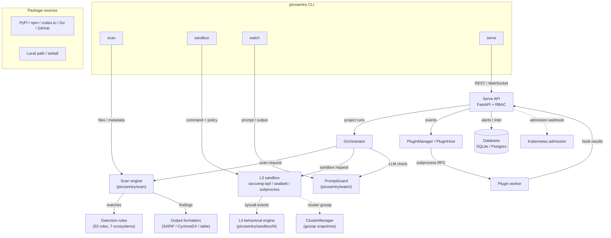

# PicoSentry Architecture

This document describes the high-level components of PicoSentry, how they
communicate, and the trust boundaries between them. It is intended for
operators, security reviewers, and contributors who need to understand the
system without reading every module.

## Component overview

## Trust boundaries

| Boundary | What it separates | Enforcement |
|----------|-------------------|-------------|
| **CLI → engine** | User input → deterministic scanner | Path validation, no network in default scan |
| **Engine → rules** | Detection logic | Signed corpus packs, rule validation |
| **Sandbox host → worker** | Server process → untrusted command | Subprocess + seccomp-bpf / seatbelt policy |
| **Plugin host → worker** | Server process → third-party plugin | Subprocess, stripped env, capability allowlist |
| **Serve API → DB** | HTTP clients → persistence | RBAC permissions, org scoping |
| **Serve API → plugins** | API callers → plugin hooks | Permission checks, `detection_write` capability gate |
| **Cluster peers** | Daemon nodes | Shared cluster token, mTLS optional |

## Data flow: project run

1. Client calls `POST /api/v1/projects/{id}/run` with a token that has
   `RUN_PROJECTS`.
2. Serve validates the token, resolves the tenant `org_id`, and passes the run
   to the orchestrator.
3. The orchestrator invokes the configured scanners (supply-chain scan,
   optional sandbox, optional watch) in sequence or in parallel.
4. Each stage returns structured findings; the orchestrator labels metrics and
   intelligence with `org_id`.
5. Critical cross-layer findings are correlated into a kill-chain timeline
   by the `CorrelationEngine`.
6. Registered plugins receive `on_project_complete` / `on_alert` hooks via
   their isolated `PluginHost` workers.
7. Alerts, intelligence, and run history are persisted to the database scoped
   by `org_id`.

## Subprocess isolation

Two components spawn subprocess workers for security boundaries:

- **L3 sandbox** (`picosentry/sandbox/l3/engine.py`) runs the target command in
  a subprocess with a syscall policy. The backend may be seccomp-bpf (Linux),
  seatbelt (macOS), or a plain subprocess fallback.
- **PicoShogun plugins** (`picosentry/serve/services/plugin_host.py`) runs
  each plugin in its own Python subprocess with a stripped environment,
  restricted working directory, and a deny-by-default capability model.

Both workers communicate with their parents over line-delimited JSON on
stdin/stdout. The parent validates responses before applying them to server
state.

## Multi-tenancy

Serve uses a flat `org_id` column to scope reads and writes. The junction table
`org_projects` enforces project ownership. API tokens carry a role; FastAPI
dependencies (`require_permission`, `require_role`) check both authentication
and authorization before touching data. Endpoints that return lists filter by
`org_id` in the service layer and in SQL queries.

## Correlation and kill chains

`CorrelationEngine` ingests events from scan, sandbox L4, and watch layers. Each
event maps to a MITRE ATT&CK kill-chain phase. When an artifact has events
across multiple layers or multiple phases, the engine builds a
`KillChainTimeline`, computes a chain score, and can trigger downstream
auto-analysis via the event bus.

## Plugin trust model

Plugins are loaded from directories listed in `PICOSHOGUN_PLUGIN_DIR`. The
manifest is signed with Ed25519; the public key must be in the server's trusted
allowlist (`BUNDLED_TRUSTED_PUBLIC_KEYS` or `PICOSHOGUN_TRUSTED_PUBLIC_KEYS`).
Signing can be made mandatory with
`PICOSHOGUN_REQUIRE_SIGNED_PLUGINS=1`. See
[`PLUGIN_DEVELOPMENT.md`](PLUGIN_DEVELOPMENT.md) for the full plugin
development guide.

## Operational interfaces

| Interface | Protocol | Authentication | Purpose |
|-----------|----------|----------------|---------|
| `picosentry serve` | HTTP / WebSocket | Bearer token + RBAC | API server and dashboard |
| `picosentry daemon` | HTTP (TLS/mTLS optional) | API token | Sandbox job submission |
| `picosentry daemon --cluster-token` | HTTP cluster gossip | Shared cluster token | Multi-node state merge |
| `picosentry watch` | HTTP / WebSocket | Bearer token | LLM prompt/output guard |
| Kubernetes admission | HTTPS webhook | TLS cert + K8s ValidatingWebhookConfiguration | Pod security validation |

## Security reviews

- [`SECURITY_REVIEW.md`](SECURITY_REVIEW.md) — `serve`
- [`SECURITY_REVIEW_DAEMON.md`](SECURITY_REVIEW_DAEMON.md) — `sandbox daemon`
- [`SECURITY_REVIEW_ADMISSION.md`](SECURITY_REVIEW_ADMISSION.md) — `admission`
- [`SECURITY_REVIEW_CLUSTER.md`](SECURITY_REVIEW_CLUSTER.md) — `cluster mode`

## See also

- [`THREAT_MODEL.md`](THREAT_MODEL.md) — trust boundaries and threat analysis
- [`PLUGIN_DEVELOPMENT.md`](PLUGIN_DEVELOPMENT.md) — plugin lifecycle and signing
- [`docs/strategic/`](strategic/) — design decisions and roadmaps
- [`docs/ops/runbook.md`](ops/runbook.md) — operational procedures
